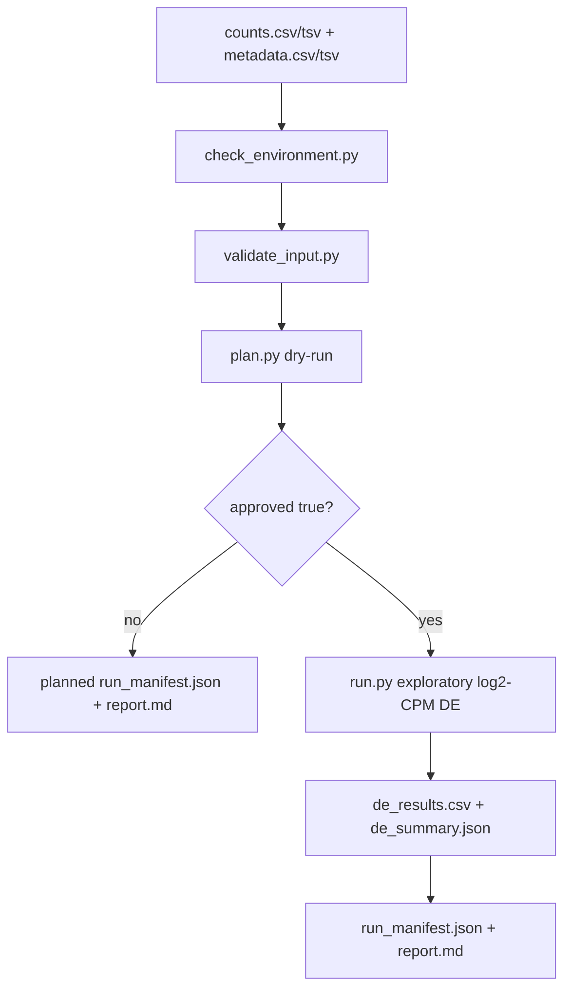

# Bulk RNA DE Workflow

```mermaid
flowchart TD
  A["counts.csv/tsv + metadata.csv/tsv"] --> B["check_environment.py"]
  B --> C["validate_input.py"]
  C --> D["plan.py dry-run"]
  D --> E{"approved true?"}
  E -- "no" --> F["planned run_manifest.json + report.md"]
  E -- "yes" --> G["run.py exploratory log2-CPM DE"]
  G --> H["de_results.csv + de_summary.json"]
  H --> I["run_manifest.json + report.md"]
```
