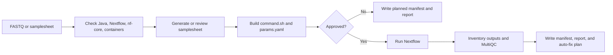

# Nextflow Development Workflow

```mermaid
flowchart LR
  A["FASTQ or samplesheet"] --> B["Check Java, Nextflow, nf-core, containers"]
  B --> C["Generate or review samplesheet"]
  C --> D["Build command.sh and params.yaml"]
  D --> E{"Approved?"}
  E -- "No" --> F["Write planned manifest and report"]
  E -- "Yes" --> G["Run Nextflow"]
  G --> H["Inventory outputs and MultiQC"]
  H --> I["Write manifest, report, and auto-fix plan"]
```

Default behavior is dry-run planning. Real Nextflow execution requires
`--approved true`.
