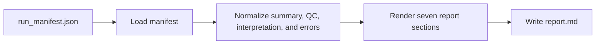

# Omics Report Workflow

```mermaid
flowchart LR
  A["run_manifest.json"] --> B["Load manifest"]
  B --> C["Normalize summary, QC, interpretation, and errors"]
  C --> D["Render seven report sections"]
  D --> E["Write report.md"]
```

Reports are generated from local manifests and do not execute analysis steps.
