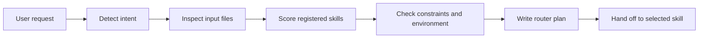

# Omics Router Workflow

```mermaid
flowchart LR
  A["User request"] --> B["Detect intent"]
  B --> C["Inspect input files"]
  C --> D["Score registered skills"]
  D --> E["Check constraints and environment"]
  E --> F["Write router plan"]
  F --> G["Hand off to selected skill"]
```

The router is plan-only. It explains the selected skill, candidate scores,
blockers, warnings, and next actions without executing long-running workflows.
