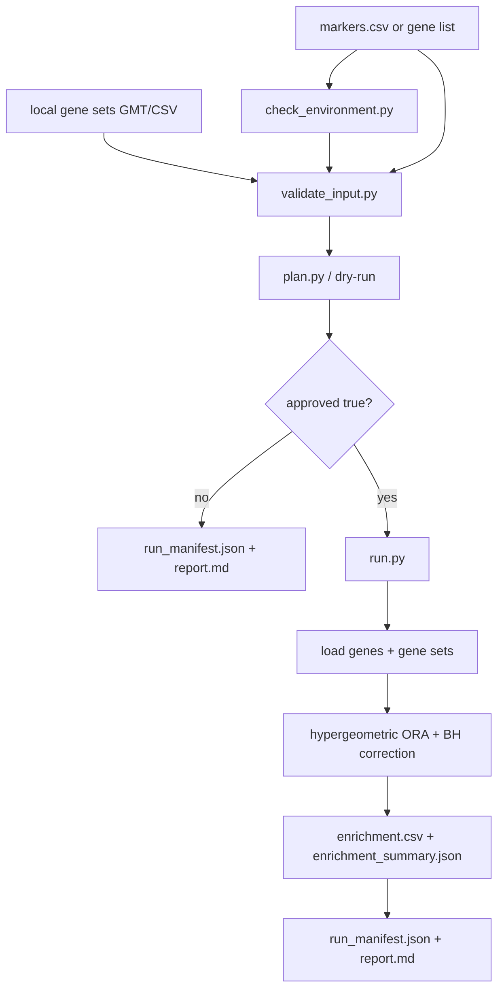

# Workflow

```mermaid
flowchart TD
  A["markers.csv or gene list"] --> B["check_environment.py"]
  C["local gene sets GMT/CSV"] --> D["validate_input.py"]
  B --> D
  A --> D
  D --> E["plan.py / dry-run"]
  E --> F{"approved true?"}
  F -- "no" --> G["run_manifest.json + report.md"]
  F -- "yes" --> H["run.py"]
  H --> I["load genes + gene sets"]
  I --> J["hypergeometric ORA + BH correction"]
  J --> K["enrichment.csv + enrichment_summary.json"]
  K --> L["run_manifest.json + report.md"]
```
