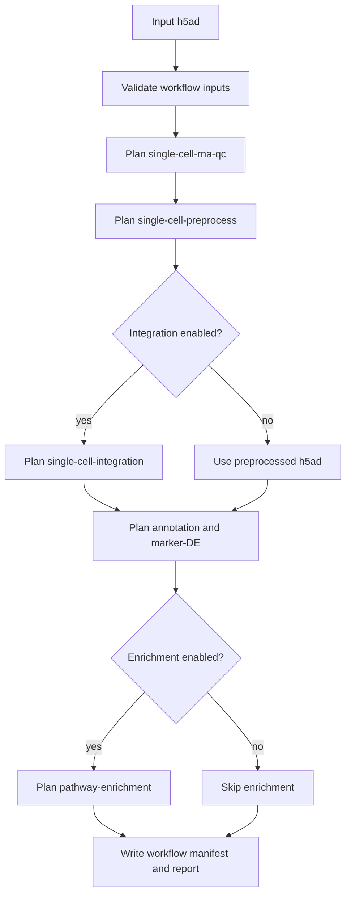

# scRNA Standard Workflow Diagram

```mermaid
flowchart TD
  A["Input h5ad"] --> B["Validate workflow inputs"]
  B --> C["Plan single-cell-rna-qc"]
  C --> D["Plan single-cell-preprocess"]
  D --> E{"Integration enabled?"}
  E -->|yes| F["Plan single-cell-integration"]
  E -->|no| G["Use preprocessed h5ad"]
  F --> H["Plan annotation and marker-DE"]
  G --> H
  H --> I{"Enrichment enabled?"}
  I -->|yes| J["Plan pathway-enrichment"]
  I -->|no| K["Skip enrichment"]
  J --> L["Write workflow manifest and report"]
  K --> L
```
