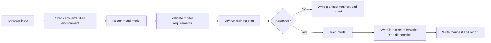

# scvi-tools Workflow

```mermaid
flowchart LR
  A["AnnData input"] --> B["Check scvi and GPU environment"]
  B --> C["Recommend model"]
  C --> D["Validate model requirements"]
  D --> E["Dry-run training plan"]
  E --> F{"Approved?"}
  F -- "No" --> G["Write planned manifest and report"]
  F -- "Yes" --> H["Train model"]
  H --> I["Write latent representation and diagnostics"]
  I --> J["Write manifest and report"]
```

Training is never started by the planning path. Use `--approved true` only
after the model choice, input fields, and compute environment are reviewed.
