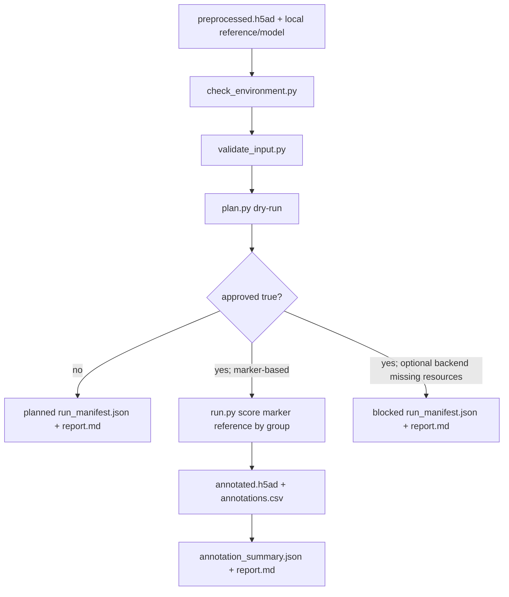

# Single-cell Annotation Workflow

```mermaid
flowchart TD
  A["preprocessed.h5ad + local reference/model"] --> B["check_environment.py"]
  B --> C["validate_input.py"]
  C --> D["plan.py dry-run"]
  D --> E{"approved true?"}
  E -- "no" --> F["planned run_manifest.json + report.md"]
  E -- "yes; marker-based" --> G["run.py score marker reference by group"]
  E -- "yes; optional backend missing resources" --> H["blocked run_manifest.json + report.md"]
  G --> I["annotated.h5ad + annotations.csv"]
  I --> J["annotation_summary.json + report.md"]
```
