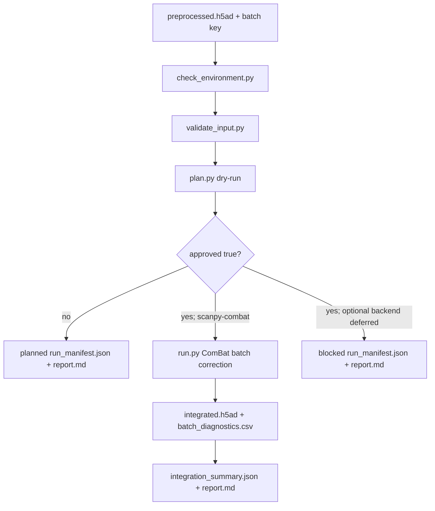

# Single-cell Integration Workflow

```mermaid
flowchart TD
  A["preprocessed.h5ad + batch key"] --> B["check_environment.py"]
  B --> C["validate_input.py"]
  C --> D["plan.py dry-run"]
  D --> E{"approved true?"}
  E -- "no" --> F["planned run_manifest.json + report.md"]
  E -- "yes; scanpy-combat" --> G["run.py ComBat batch correction"]
  E -- "yes; optional backend deferred" --> H["blocked run_manifest.json + report.md"]
  G --> I["integrated.h5ad + batch_diagnostics.csv"]
  I --> J["integration_summary.json + report.md"]
```
