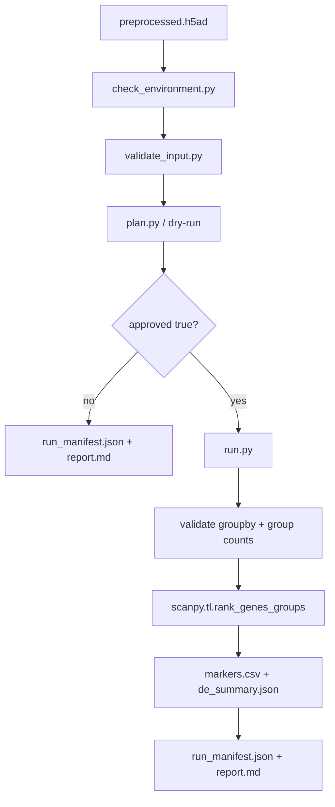

# Workflow

```mermaid
flowchart TD
  A["preprocessed.h5ad"] --> B["check_environment.py"]
  B --> C["validate_input.py"]
  C --> D["plan.py / dry-run"]
  D --> E{"approved true?"}
  E -- "no" --> F["run_manifest.json + report.md"]
  E -- "yes" --> G["run.py"]
  G --> H["validate groupby + group counts"]
  H --> I["scanpy.tl.rank_genes_groups"]
  I --> J["markers.csv + de_summary.json"]
  J --> K["run_manifest.json + report.md"]
```
