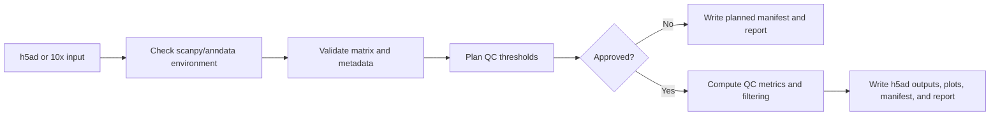

# Single-cell RNA-seq QC Workflow

```mermaid
flowchart LR
  A["h5ad or 10x input"] --> B["Check scanpy/anndata environment"]
  B --> C["Validate matrix and metadata"]
  C --> D["Plan QC thresholds"]
  D --> E{"Approved?"}
  E -- "No" --> F["Write planned manifest and report"]
  E -- "Yes" --> G["Compute QC metrics and filtering"]
  G --> H["Write h5ad outputs, plots, manifest, and report"]
```

The source input is not modified in place.
