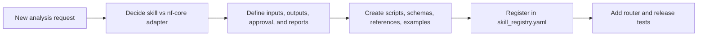

# Skill Authoring Workflow

```mermaid
flowchart LR
  A["New analysis request"] --> B["Decide skill vs nf-core adapter"]
  B --> C["Define inputs, outputs, approval, and reports"]
  C --> D["Create scripts, schemas, references, examples"]
  D --> E["Register in skill_registry.yaml"]
  E --> F["Add router and release tests"]
```

If the request only adds an nf-core workflow, use the
`nextflow-development` adapter template instead of creating a new skill.
